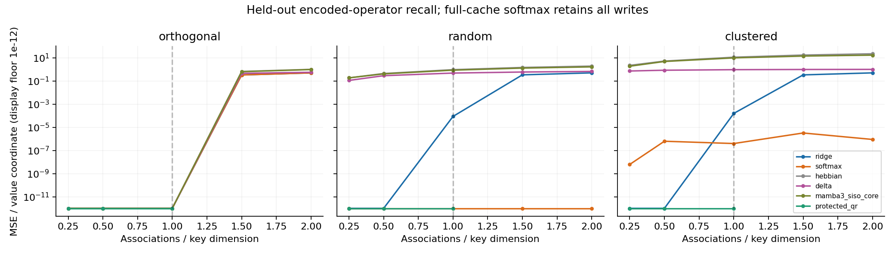
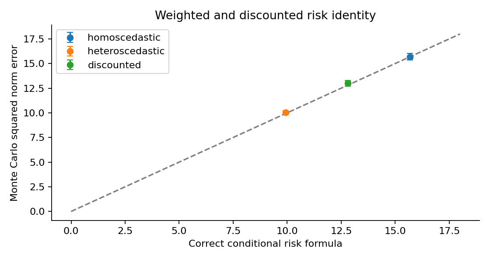
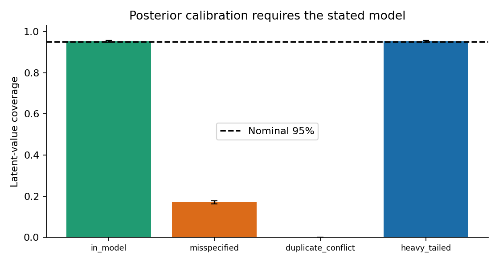
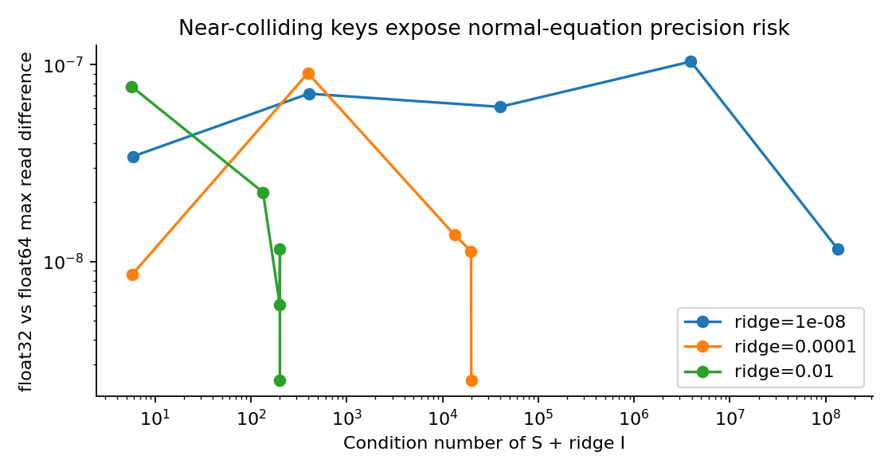
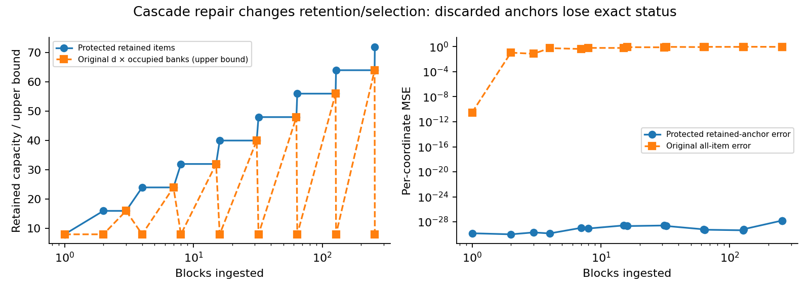

# Phase 02: full statistical and Monte Carlo report

The investigation is complete. The original universal dominance claims do not survive. The repaired exact branch retrieves independent protected associations accurately and handles signed linear queries; the Bayesian branch is calibrated under its specified prior and noise model. Attention wins on arbitrary recall beyond the fixed-state capacity. These are untrained operator results, not language-model or TPU performance results.

## Reproduction and provenance

```sh
uv sync --frozen
OPENBLAS_NUM_THREADS=1 OMP_NUM_THREADS=1 uv run python -m analysis.run
uv run python scripts/report.py
uv run python scripts/verify_results.py
```

Run mode: **full**. CPU runtime: 77.4 seconds. Python 3.10.12, NumPy 2.2.6, SciPy 1.15.3. The base commit is `a3d61e159e62a97a9690e4e08f06aea7acebea60`; per-file SHA-256 hashes in `summary.json` identify the actual added source, including the dirty-tree research implementation. This is not a claim that the base commit already contains those sources.

Protocol SHA-256: `c718cdfe65f78f1c185ecbbddd192d33aeb990add6f22351cba3bfc2f31f716d`. Raw-array SHA-256: `fa344176097344fc0c31b25e9bac7d1f0bd1f0dcf8af30fe2e8a5433133906e9`. [Configuration](../configs/protocol.json), [machine summary](summary.json), [all model/scenario results](recall.csv), and [raw trial arrays](trials.npz) are retained.

## Design and inference limits

Keys have dimension 16; values dimension 4. Each of 15 geometry/load recall scenarios has 96 independent development trials and 1024 held-out trials. There are 1,024 trials for each signed-query scenario, 4,096 noise replicates per conditional-risk design, 8,192 trials per calibration condition, 4,096 per repeated-write condition, 1,024 per graph/ridge/hop condition and per dimension/load bound condition, and 256 independent held-out trajectories per drift regime. Deterministic floor/conditioning diagnostics and one cascade stream are numerical witnesses, not independent-trial statistical estimates.

Each model is tuned using the development stream only. Root seed and scenario/split names determine independent generators; changing loop order does not change a scenario's samples. Primary loss is MSE per value coordinate, averaged over queries in one trial. Paired differences reuse the same keys/values across methods. Mean t intervals, paired bootstrap intervals, Bonferroni paired t intervals and Holm-adjusted directional t tests are reported. These are finite-sample statistical approximations, not distribution-free coverage theorems. Near the square random-key capacity boundary, rare ill-conditioned trials create skew/heavy tails: inspect raw arrays and both interval types. Negative lower loss bounds are left visible rather than silently truncated.

The recall comparison family has 99 comparisons. The 2000 bootstrap draws resolve ordinary 95% tails reasonably; the Bonferroni percentile tails can be below one draw and should be treated as descriptive. Use the reported adjusted t intervals/Holm p-values with the stated assumptions for inference; do not read a tiny floating-point loss difference as a practical superiority claim. Differences below 1e-10 per coordinate are numerically tied for the headline discussion.

## Peer definitions and resource fairness

Softmax retains every encoded key/value and tunes inverse temperature over the declared grid. Hebbian, diagonal preconditioning and online delta-rule memories are additional controls. Mamba-3 SISO uses the exponential-trapezoidal previous/current-input recurrence and real-pair phases; the tied rank-two MIMO control isolates the recurrence at the same encoded data. Conformance tests cover nonzero phases, variable dt/gates and genuine rank>1 inputs against an independent cumulative-rotary reference from the pinned upstream equations. The tied MIMO lifts collapse to SISO at zero phase; this is reported, not presented as a trained MIMO architecture benchmark.

There are no learned encoders, MLPs, normalization/bias learning, output gates, optimization over neural weights, parameter-matched trained networks, or TPU timing in this experiment. A trained model could learn much better keys/features/read projections. Consequently these results isolate algebra and cannot rank trained Mamba-3 versus Mamba 4 or Transformer perplexity. Full-cache attention has O(K(d+p)) state while ridge has d(d+1)/2+dp evidence words plus factor buffers; protected QR stores extra key/factor/value/ID state. A capacity win with more cache is allowed and does not contradict the finite-state converse.

## Recall across capacity and geometry



The plot displays errors below 1e-12 at a common floor; the table/CSV retain their actual values. Orthogonal scenarios above d intentionally repeat addresses with conflicting arbitrary values. Random/clustered scenarios above d use distinct keys. These are different failure modes and must not be pooled.

| Geometry | K | Ridge MSE | Full-cache softmax MSE | Protected QR MSE |
|---|---:|---:|---:|---:|
| orthogonal | 4 | 1.00136e-16 | 0 | 7.03739e-32 |
| orthogonal | 8 | 9.92076e-17 | 0 | 9.05691e-32 |
| orthogonal | 16 | 1.00436e-16 | 0 | 1.65466e-31 |
| orthogonal | 24 | 0.330118 | 0.330118 | outside contract |
| orthogonal | 32 | 0.497492 | 0.497492 | outside contract |
| random | 4 | 2.14134e-16 | 0 | 7.84511e-32 |
| random | 8 | 1.0743e-15 | 0 | 1.57939e-31 |
| random | 16 | 8.64599e-05 | 8.29875e-26 | 1.23407e-26 |
| random | 24 | 0.33722 | 3.18089e-26 | outside contract |
| random | 32 | 0.501167 | 1.19823e-31 | outside contract |
| clustered | 4 | 1.21247e-14 | 6.16986e-09 | 2.03089e-31 |
| clustered | 8 | 5.40754e-14 | 6.22429e-07 | 4.35951e-31 |
| clustered | 16 | 0.000157249 | 3.94289e-07 | 4.27244e-27 |
| clustered | 24 | 0.334078 | 3.21144e-06 | outside contract |
| clustered | 32 | 0.50001 | 8.88061e-07 | outside contract |

At independent K<=d, the protected QR branch reaches numerical exactness. Finite ridge can remain biased for ill-conditioned square key matrices. At K>d, random arbitrary values have projection loss approaching 1-d/K; the observed ridge losses around 1/3 (K=24) and 1/2 (K=32) are the expected compression effect. Sharp full-cache softmax performs near-exact lookup of distinct keys across these loads. The universal dominance target is therefore falsified. The full table includes every additional baseline and the paired comparisons in `summary.json`, including losses for Mamba 4.

## Signed linear-functional queries

| Geometry | Ridge | Softmax | Mamba-3 SISO core | Protected QR |
|---|---:|---:|---:|---:|
| random | 7.14907e-15 | 6.29473 | 3.2178 | 1.45856e-30 |
| clustered | 4.30599e-13 | 6.64853 | 39.1238 | 4.18228e-30 |

Targets are V alpha for arbitrary signed Gaussian coefficient vectors; queries are K alpha. Linear regression/interpolation can realize these within the key span. A single normalized positive smoother remains in the value convex hull. This measured advantage pertains to this read operator; a multi-layer Transformer with output transformations is a broader class.

## Exact conditional regression risk



| Condition | Correct theory | Empirical mean | 95% interval | Original S-based variance |
|---|---:|---:|---|---:|
| homoscedastic | 15.6737 | 15.6893 | [15.3554, 16.0231] | 15.4955 |
| heteroscedastic | 9.93869 | 10.0236 | [9.80757, 10.2396] | 9.66335 |
| discounted | 12.799 | 13 | [12.7187, 13.2814] | 33.365 |

The discounted covariance is sum gamma_i squared beta_i k_i k_i transpose, rather than S. The original discounted variance term is 33.365 in this design, while the correct variance is 11.4771; the remaining bias is 1.32183. All three empirical risks agree with the corrected formula within five Monte Carlo standard errors. Each design/operator/query is held fixed while observation noise is replicated; this verifies those conditional cases, not every possible data-generating process.

## Calibration and conflict



| Condition | Nominal 95% coverage | Wilson 95% interval | MSE | Mean c |
|---|---:|---|---:|---:|
| in_model | 95.239% | [94.757%, 95.680%] | 0.688862 | 0.684741 |
| misspecified | 17.029% | [16.230%, 17.858%] | 71.5575 | 0.682717 |
| duplicate_conflict | 0.000% | [0.000%, 0.047%] | 99.9948 | 0.0615385 |
| heavy_tailed | 95.312% | [94.833%, 95.749%] | 0.683091 | 0.685499 |

New noisy observations use c plus inverse query precision and achieve 94.885% coverage in the specified Gaussian model. In the prior-mismatch case, W has 20 times the assumed standard deviation. In the duplicate-conflict case, the same key alternates labels -10 and +10; the target is a particular conflicting write. Its small c confidently estimates a shared mean while failing arbitrary item recall. The heavy-tailed variance-matched case happens to have close aggregate 95% coverage here, and does not establish Gaussian tail calibration outside the model.

## Repeated evidence and forgetting

Equal-noise repeats have the familiar sigma squared / n unregularized per-coordinate risk. Precision-weighted softmax with log(beta) score offsets matches the unbiased inverse-variance average. Finite ridge adds its documented bias. The unequal-noise case refutes the original claim that smoothing cannot implement precision weighting. Every n/noise combination and analytic risk is retained in `summary.json` and `trials.npz`.

| Drift variance Q | Development-selected ridge | Selected attention window | Attention loss minus ridge (paired) |
|---|---|---|---:|
| 0.0 | ridge_lambda_1.0 | attention_window_256 | 0.000775197 |
| 0.001 | ridge_lambda_0.95 | attention_window_64 | 0.00138177 |
| 0.05 | ridge_lambda_0.9 | attention_window_4 | 0.0309732 |

Both methods use causal observations and separate development selection. The latent scalar follows a random walk with observation variance one. Each 512-step trajectory, averaged after 128 burn-in steps, is one independent replicate. All-history uniform attention is another control. Tuned forgetting improves changing-operator tracking; this does not validate learned gates in a trained network or universal superiority over all attention windows.

## Floor and numerical precision



At d=64 and lambda=0.99, the original phantom rule's stationary floor spans 0.716225 to 1.34906 times epsilon despite satisfying its stated condition. The repaired initialized cyclic prior has minimum epsilon and maximum 1.88357 epsilon. It is an anisotropic model with a proved floor, not an approximation we call the same isotropic posterior. Across the tested dimensions/decays, the factor residual and dense-read comparisons pass; exact numeric values and all limits are in `summary.json`.

Near-dependent keys make float32 normal equations unreliable, and reducing epsilon can destroy representable positive definiteness. QR avoids squaring the key condition number for the protected branch but still needs conditioning-aware selection. Read derivatives can grow as inverse epsilon even when the state transition is contractive. The suite checks all terminal-stream input gradients by finite differences; variable-gate cyclic-prior/selection gradients remain phase-03 implementation requirements.

## Cascade and multi-hop repair



After 256 eight-item blocks, the original binary counter has 1 occupied bank and all-item MSE 0.97171. The repaired redundant counter has 9 banks at 8 levels, retaining 72 exact anchors with MSE 1.42591e-28. It discards exact status for 1976 items while retaining their background evidence. This is a repaired retention contract, with additional geometry/routing storage and cubic reselection work per merge. It does not preserve every child association.

A full-rank eligible source block and correct bank routing are assumptions. Query routing is not learned or timed here. The cascade plot is a numerical witness on one seeded stream; count bounds are mathematical and Lean-checked, and implementation tests inspect every prefix. Additive background merge remains valid; protected selection is not generally associative. No age-only power-law risk guarantee is claimed.

Functional-graph hops test permutation and many-to-one maps, three ridge values, and H in {1,2,4,8}. At unit code norm, a many-to-one graph has operator norm sqrt(max indegree), so L can exceed one. All observed perturbations satisfy the corrected geometric-envelope bound with the actual L. H dependent reads incur H sequential solves. An affine auxiliary state also distinguishes AB from BA where undiscounted token-local Gaussian evidence cannot; that construction is a feasible order repair, not proof of general reasoning.

## Decision for the next phase

Carry forward the conditional Gaussian ridge branch for noisy regression, the QR-protected branch for exact retained recall, the proved cyclic floor when constant forgetting is appropriate, explicit fixed-floor fallbacks, and order-sensitive scan heads where needed. Preserve the assumption/resource ledger. Train full matched models only in the later authorized phases and test actual routing, gate learning, features, precision, fusion and throughput.

Phase-01/02 investigation completion is verified separately from performance promotion. Universal peer dominance, a 60M trained win, a 125M result and a TPU speedup remain unestablished or, for universal growing-cache dominance, disproved. The repository's gates keep these outcomes visible.

## Sources

The [Mamba-3 paper](https://arxiv.org/html/2603.15569v1) and [pinned upstream step implementation](https://github.com/state-spaces/mamba/blob/e9594ce1c732d97440f0332fdc43170a2294dbfa/mamba_ssm/ops/triton/mamba3/mamba3_siso_step.py) specify the peer primitive. The [test-time regression framework](https://arxiv.org/html/2501.12352v3), [Miras](https://arxiv.org/html/2504.13173v1), and [Preconditioned DeltaNet](https://arxiv.org/html/2604.21100v1) establish relevant prior work; these experiments do not claim to reproduce their trained results. See the mathematical analysis for exact derivations and formal coverage.
