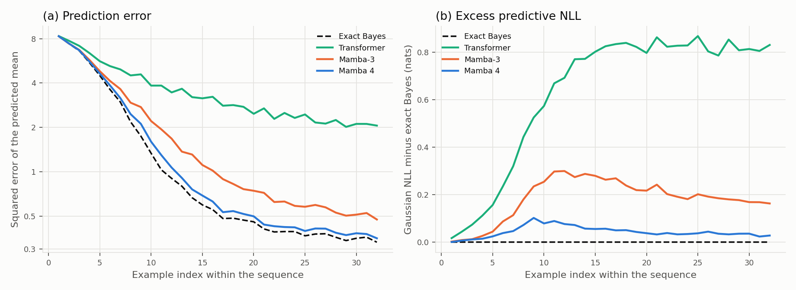

# In-context regression against exact Bayes

Each sequence draws w ~ N(0, I_8) and 32 examples with y = w·x + 0.5ε. At every x the model outputs a mean and a log variance for y, trained by Gaussian NLL. The exact posterior predictive under this model is the reference. Matched small models (two blocks of width 128) train for 4,000 steps of 256 sequences. The learning rate is chosen by development NLL (seed 12); scores use evaluation seed 13. The design was recorded before the run (`validation/synthetic-protocol.md`).

| Model | LR | MSE (all) | MSE (late) | NLL (all) | NLL (late) | 90% coverage (late) |
|---|---:|---:|---:|---:|---:|---:|
| Exact Bayes | — | 1.721 | 0.398 | 1.3176 | 0.9405 | 0.900 |
| Transformer | 0.0015 | 3.651 | 2.373 | 1.9503 | 1.7662 | 0.903 |
| Mamba-3 | 0.0015 | 2.099 | 0.630 | 1.5010 | 1.1406 | 0.897 |
| Mamba 4 | 0.005 | 1.815 | 0.431 | 1.3614 | 0.9778 | 0.897 |

Late = examples 17–32 of each sequence. Means over 2,048 evaluation sequences from one training seed per model; the per-sequence arrays were not stored, so no interval is given. The gaps between models are large relative to the sequence-level noise of these means.

