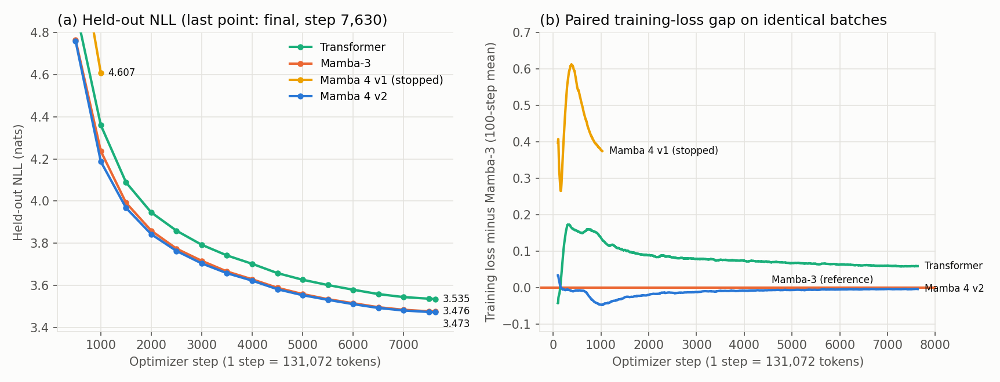

# 60M, 1B-token, single-seed screen (protocol screen-60m-v2)

| Model | Parameters | Held-out NLL | Fresh-holdout NLL | Train tokens/s | Recall accuracy |
|---|---:|---:|---:|---:|---:|
| transformer | 59,985,920 | 3.535236 | 3.486907 | 1,379,725 | 0.141 |
| mamba3 | 59,968,896 | 3.475755 | 3.426602 | 152,335 | 0.234 |
| mamba4 | 59,893,216 | 3.472684 | 3.422266 | 93,391 | 0.352 |

Declared Mamba 4 screen win: **True**.

- screen_heldout, mamba4_minus_transformer: -0.06255 nats (95% block bootstrap -0.06448 to -0.06056; 1944/2048 sequences lower)
- screen_heldout, mamba4_minus_mamba3: -0.00307 nats (95% block bootstrap -0.00442 to -0.00171; 1090/2048 sequences lower)
- fresh_holdout, mamba4_minus_transformer: -0.06464 nats (95% block bootstrap -0.06645 to -0.06270; 1981/2048 sequences lower)
- fresh_holdout, mamba4_minus_mamba3: -0.00434 nats (95% block bootstrap -0.00560 to -0.00309; 1143/2048 sequences lower)

Scheduled held-out NLL at matched optimizer steps:

| Step | Transformer | Mamba-3 | Mamba 4 v2 |
|---:|---:|---:|---:|
| 500 | 4.9144 | 4.7641 | 4.7587 |
| 1,000 | 4.3596 | 4.2364 | 4.1869 |
| 1,500 | 4.0881 | 3.9915 | 3.9673 |
| 2,000 | 3.9457 | 3.8592 | 3.8424 |
| 2,500 | 3.8592 | 3.7741 | 3.7632 |
| 3,000 | 3.7925 | 3.7164 | 3.7040 |
| 3,500 | 3.7419 | 3.6657 | 3.6576 |
| 4,000 | 3.7021 | 3.6287 | 3.6225 |
| 4,500 | 3.6581 | 3.5886 | 3.5817 |
| 5,000 | 3.6266 | 3.5587 | 3.5534 |
| 5,500 | 3.6015 | 3.5345 | 3.5313 |
| 6,000 | 3.5794 | 3.5154 | 3.5110 |
| 6,500 | 3.5586 | 3.4963 | 3.4928 |
| 7,000 | 3.5444 | 3.4841 | 3.4807 |
| 7,500 | 3.5367 | 3.4769 | 3.4737 |

Learned memory at every probe: minimum precision eigenvalue 0.7129 against floor minimum 0.7080; maximum condition 108.5.

Peers are the audited screen-60m-v1 runs; their execution sources are
byte-identical to v2 apart from Mamba 4 files and additive config fields.
Intervals treat whole 1,024-token sequences in blocks of eight as units.
One training seed cannot establish robustness. No 125M run was performed.
